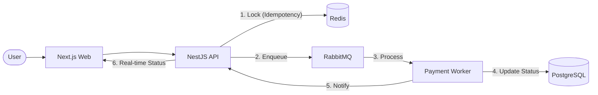

# 💳 Payment Gateway

Simulador de orquestração de pagamentos com **idempotência via Redis**, **processamento assíncrono via RabbitMQ**, status em tempo-real via **WebSocket**, e persistência em **PostgreSQL**.

## Stack

| Layer | Technology | Infrastructure (Cloud) |
|---|---|---|
| **Frontend** | [Next.js](https://nextjs.org/) (React, TypeScript) | Google Cloud Run / Static Hosting |
| **Backend** | [NestJS](https://nestjs.com/) (Node.js) | Google Cloud Run |
| **Database** | [PostgreSQL](https://www.postgresql.org/) (TypeORM) | [Neon.tech](https://neon.tech/) |
| **Cache/Locks** | [Redis](https://redis.io/) (ioredis) | [Upstash](https://upstash.com/) |
| **Messaging** | [RabbitMQ](https://www.rabbitmq.com/) (amqplib) | [CloudAMQP](https://www.cloudamqp.com/) |

---

## 🏗️ Architecture Design



---

## ☁️ Deployment Guide (Cloud Run)

### 1. Database (PostgreSQL)
A **Neon** project is required for serverless SQL.
- **Host**: `ep-solitary-mountain-amdlhgf7-pooler.c-5.us-east-1.aws.neon.tech`
- **User**: `neondb_owner`

### 2. Environment Variables (.env)

**Backend:**
```env
DB_HOST=...
DB_USER=neondb_owner
DB_PASS=...
DB_NAME=neondb
REDIS_URL=rediss://... # Supports SSL/TLS
RABBITMQ_URL=amqp://...
```

**Frontend:**
```env
NEXT_PUBLIC_API_URL=https://[YOUR-API-URL]/api
NEXT_PUBLIC_WS_URL=https://[YOUR-API-URL]/payments
```

---

## 💻 Local Development

1. **Infrastructure**:
   ```bash
   docker-compose up -d
   ```

2. **Backend**:
   ```bash
   cd backend && npm install && npm run start:dev
   ```

3. **Frontend**:
   ```bash
   cd frontend && npm install && npm run dev
   ```

---

## 📄 License

MIT. Build with ❤️ for modern payment systems.
